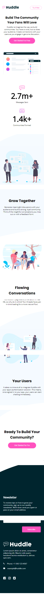

# Frontend Mentor - Huddle landing page with curved sections solution

This is a solution to the [Huddle landing page with curved sections challenge on Frontend Mentor](https://www.frontendmentor.io/challenges/huddle-landing-page-with-curved-sections-5ca5ecd01e82137ec91a50f2). Frontend Mentor challenges help you improve your coding skills by building realistic projects. 

## Table of contents

  - [Overview](#overview)
  - [The challenge](#the-challenge)
  - [Screenshot](#screenshot)
  - [Links](#links)
  - [My process](#my-process)
  - [Built with](#built-with)
  - [Continued development](#continued-development)

**Note: Delete this note and update the table of contents based on what sections you keep.**

## Overview
Huddle landing page with curved sections is a landing page with curve at the top and bottom of every section, it is responsive across all screen size and the buttons has over state for interactive elements
### The challenge

Users should be able to:

- View the optimal layout for the site depending on their device's screen size
- See hover states for all interactive elements on the page

### Screenshot




### Links

- Solution URL: [Add solution URL here](https://github.com/TRIPLE-ADE/Curve-Huddle-landing-page/)
- Live Site URL: [Add live site URL here](https://triple-ade.github.io/Curve-Huddle-landing-page/)

## My process
- Understanding the interface
- structure my web page
- style the page
- make the page responsive
- and added interactive element

### Built with

- Semantic HTML5 markup
- CSS custom properties
- Flexbox

### What I learned

Use this section to recap over some of your major learnings while working through this project. Writing these out and providing code samples of areas you want to highlight is a great way to reinforce your own knowledge.

To see how you can add code snippets, see below:

```html
<h1>Some HTML code I'm proud of</h1>
```
```css
.proud-of-this-css {
  color: papayawhip;
}
```
```js
const proudOfThisFunc = () => {
  console.log('🎉')
}
```


### Continued development
- css variable
- javaScript DOM
- Array
- object

## Author

- Website - [Add your name here](https://triple-ade.github.io/Curve-Huddle-landing-page/)
- Frontend Mentor - [@TRIPLE-ADE](https://www.frontendmentor.io/profile/TRIPLE-ADE)
- Twitter - [@Triple123A](https://www.twitter.com/Triple123A)


